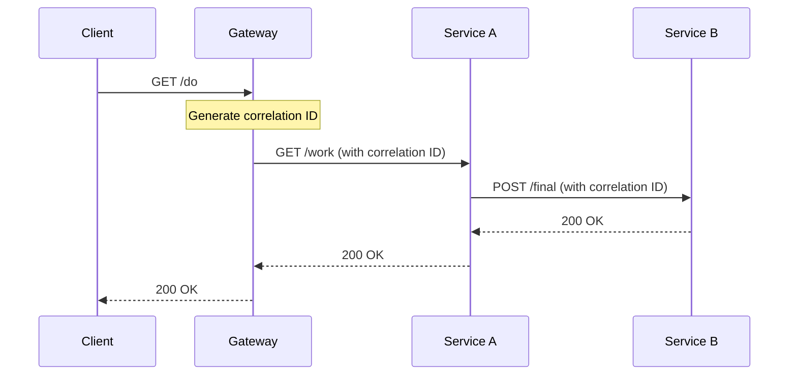

# Correlation ID Microservices Demo

Demonstração de propagação de Correlation ID através de microserviços Go usando middleware personalizado.

## Arquitetura



## Serviços

- **Gateway** (`:8080`) - Ponto de entrada, gera correlation ID
- **Service A** (`:8081`) - Serviço intermediário
- **Service B** (`:8082`) - Serviço final

## Execução

### Docker Compose (Produção)
```bash
finch compose up -d --build
curl -i http://localhost:8080/do
```

### Execução Local (sem Docker)

#### Terminal 1 - Service B
```bash
cd svc-b
go run main.go
# Escuta em :8080
```

#### Terminal 2 - Service A
```bash
cd svc-a
SVC_B_URL=http://localhost:8080/final go run main.go
# Escuta em :8080 (conflito - usar porta diferente)
ADDR=:8081 SVC_B_URL=http://localhost:8080/final go run main.go
```

#### Terminal 3 - Gateway
```bash
cd gateway
SVC_A_URL=http://localhost:8081/work go run main.go
# Escuta em :8080 (conflito - usar porta diferente)
ADDR=:8082 SVC_A_URL=http://localhost:8081/work go run main.go
```

#### Teste
```bash
curl -i http://localhost:8082/do
```

### Debug Individual (VS Code)
1. Abra o projeto no VS Code
2. Vá para Run and Debug (Ctrl+Shift+D)
3. Selecione a configuração desejada:
   - "Debug Gateway"
   - "Debug Service A" 
   - "Debug Service B"
4. Pressione F5

### Debug Completo
Para debugar toda a cadeia:
```bash
# Pare os containers
finch compose down

# Inicie os 3 debugs no VS Code
# Teste o fluxo completo
curl -i http://localhost:8080/do
```

## Correlation ID

O middleware `correlation` automaticamente:
- Gera um UUID se não existir
- Propaga via header `X-Correlation-Id`
- Adiciona ao contexto da requisição
- Registra em todos os logs

## Logs

Cada serviço registra:
- Início/fim de cada handler
- Correlation ID em todas as operações
- Erros com contexto completo
- Configurações na inicialização

## Estrutura

```
├── gateway/          # Serviço de entrada
├── svc-a/           # Serviço intermediário
├── svc-b/           # Serviço final
├── shared/
│   └── correlation/ # Middleware de correlation ID
├── .vscode/         # Configurações de debug
└── compose.debug.yaml
```