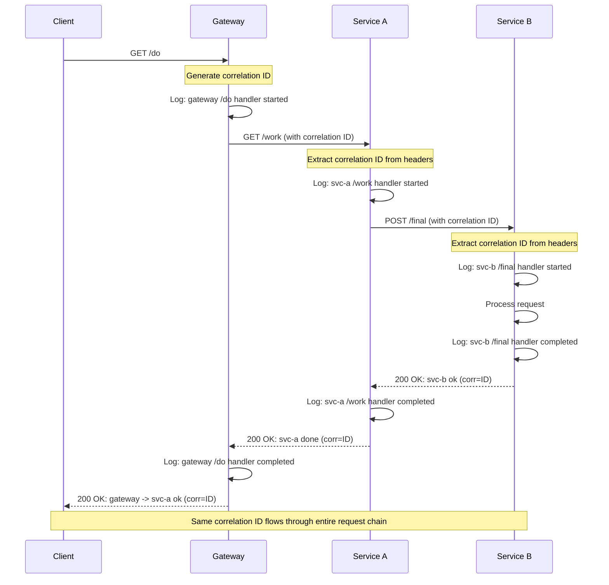

# Correlation ID Flow Sequence Diagram

## Flow Description

1. **Client** makes GET request to `/do` endpoint
2. **Gateway** generates correlation ID and logs request start
3. **Gateway** forwards request to Service A with correlation ID in headers
4. **Service A** extracts correlation ID and logs request start
5. **Service A** makes POST request to Service B with same correlation ID
6. **Service B** processes request and responds with correlation ID
7. **Service A** responds to Gateway with correlation ID
8. **Gateway** responds to Client with correlation ID

## Debugging Points

- Each service logs when handlers start/complete
- Correlation ID is preserved throughout the entire chain
- HTTP status codes and errors are logged with correlation context
- Service URLs and configurations are logged at startup